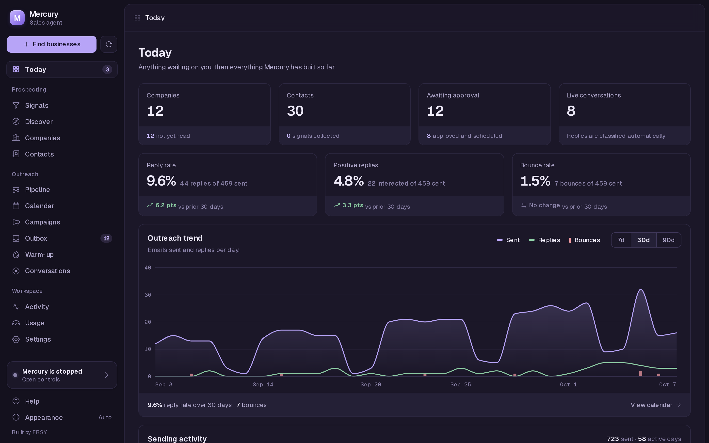

# Mercury

An autonomous sales agent that runs on your Claude Code subscription.

Mercury finds businesses that match your ideal customer, collects specific facts about each one, writes short cold emails that reference those facts, sends them from your own mailboxes, and handles the replies. It runs locally on a 15-minute heartbeat and keeps everything in a SQLite file. Its model calls go through the `claude` CLI in headless mode, so they count against the Claude Pro or Max plan you already have rather than a per-token API bill. By default, nothing is sent until you approve it.


## What it does

- **Finds businesses.** Searches discovery providers (OpenStreetMap for free; DataForSEO, Serper and others for paid) for companies matching your ICP. Every run is estimated before it spends anything and stops at a hard spend cap.
- **Learns about them.** Reads each company's website with plain HTTP requests (no browser, no model call) and records signals such as the incumbent agency, ad pixels, online booking, schema markup, a stale blog, open roles and named team members.
- **Lets you decide what matters.** Mercury proposes a catalog of 23 signals. It collects only the ones you confirm, and a target list is a query over those signals ("running Google Ads AND NOT has online booking").
- **Finds and verifies email addresses.** Learns each company's address pattern, then verifies one candidate through Reoon, ZeroBounce or Hunter. Every address is tagged `verified`, `risky` (catch-all), `guess` or `invalid`. Guesses are never sent.
- **Writes sequences.** Three short emails per prospect (an opener and two follow-ups), using editable Markdown frameworks and a ban list of AI-sounding phrases.
- **Sends from your mailboxes.** Gmail API or any SMTP+IMAP inbox. It rotates across several mailboxes, each with its own warm-up ramp and bounce health gate. A thread stays on the mailbox it started from.
- **Handles replies.** Classifies intent, stops the sequence when someone replies, advances the conversation stage, and drafts a response for your approval. Opt-outs are honored immediately. Bounces mark the address invalid, and a high bounce rate pauses all sending.
- **Shows its work.** A local dashboard covers today's queue, the pipeline, a calendar of scheduled sends, the approval outbox, warm-up status, signals, discovery and Claude quota usage.
- **Exports lists.** `mercury export` writes a sequencer-ready CSV, so you can use Mercury as a list builder even if it never sends anything.

## How it works

Each heartbeat runs the same steps:

```
wake → quiet hours? → Claude quota OK? → decide → act → log → sleep (15 min)

decide (deterministic, no model call):
  send due emails > write sequences > prospect > idle (analyze)

replies, inbox sweeps and website profiling run alongside every cycle
```

Five agents do the work:

| Agent | Role |
|---|---|
| **Scout** | Scores and personalizes prospects. Python handles search and email resolution; Claude is used only for judgment. |
| **Writer** | Writes the three-email sequence, and regenerates single drafts on request. |
| **Sender** | Stages emails in the outbox with a scheduled time, then sends approved items with human-like pacing, daily caps, warm-up limits and a deterministic pre-send gate. |
| **Handler** | Polls inboxes, deduplicates replies, classifies intent, detects bounces and opt-outs, and queues responses for approval. |
| **Analyst** | Runs on idle cycles and summarizes pipeline and campaign performance. |

Two design rules shape the rest of the system:

- **Mercury proposes, you confirm.** No signal is collected and no paid discovery runs until you turn it on (on the Signals tab, or with `mercury signals --confirm`). That keeps spending intentional and makes every prospect list explainable.
- **Nothing sends without approval.** Every outgoing email, including replies, waits in the Outbox. You can approve, reject, edit, or ask the Writer to regenerate a draft with an instruction. When you trust the output, set `channels.email.require_approval: false`.

Sales knowledge lives in `skills/` and agent prompts live in `prompts/`. Both are plain Markdown that is loaded into each call, so an edit takes effect on the next heartbeat.

## Quick start

Requirements: Python 3.11+, the Claude Code CLI logged in to a Pro or Max plan (`claude login`), and a mailbox to send from, ideally on a dedicated secondary domain.

```bash
git clone <repo-url> mercury && cd mercury
python3 -m venv .venv && source .venv/bin/activate
pip install -e .
python -m playwright install chromium     # only needed for LinkedIn prospecting
```

On macOS, `python3` may be the system 3.9. If so, create the venv with `python3.13 -m venv .venv`.

You can also run `claude` in the repo and say "set up Mercury for me". The bundled `CLAUDE.md` makes Claude Code walk you through the steps below.

**1. Add credentials.** Copy the template and fill in a mail provider. A verifier key is strongly recommended, because without one every address stays a `guess` and is never sent.

```bash
cp .env.example .env
```

```bash
# Gmail / Google Workspace (recommended); then run: mercury gmail auth
GMAIL_CLIENT_ID=
GMAIL_CLIENT_SECRET=
# ...or any SMTP + IMAP mailbox: SMTP_HOST, SMTP_USERNAME, SMTP_PASSWORD, IMAP_HOST

REOON_API_KEY=          # 600 free verifications/month
```

Every variable in `.env.example` is commented with where to get it.

**2. Teach it your product.** Either run the interactive wizard or train Mercury from your website. Training writes `mercury.yaml` and `skills/product_knowledge.md`.

```bash
mercury setup                          # interactive wizard
mercury train https://your-company.com # or learn from your site
```

Then set `compliance.postal_address` in `mercury.yaml`. The sender holds the outbox until a postal address is configured, because it is added to the legal footer of every email.

**3. Confirm signals and find businesses.**

```bash
mercury signals --confirm free   # turn on every signal that costs nothing
mercury discover --estimate      # projected spend; calls nothing
mercury discover                 # free OpenStreetMap source
```

**4. Watch it and start it.**

```bash
mercury dashboard                # http://localhost:5555
mercury run                      # heartbeat loop; Ctrl+C to stop
```

To explore the dashboard with sample data first, run `python scripts/seed_demo.py` and start the dashboard with the environment line it prints.

## Screenshots

| | |
|---|---|
|  **Pipeline**: prospects by conversation stage. |  **Calendar**: scheduled first emails and follow-ups. |
|  **Outbox**: review, edit, regenerate, approve. |  **Warm-up**: per-mailbox ramps, health and DNS checks. |

<details>
<summary>Dark mode and the sending heatmap</summary>




</details>

## Costs

| Item | Cost |
|---|---|
| Claude (all agent reasoning and writing) | Your existing Claude Pro or Max plan. Mercury reads your live quota and stops at `usage.max_daily_claude_percent` (default 80%), leaving headroom for your own use. |
| Sending mailbox | About $7/month for a Google Workspace inbox on a secondary domain, or any SMTP mailbox you already have. |
| Discovery | OpenStreetMap is free with no account (coverage is thin for service-area trades). DataForSEO Business Listings costs $0.372 per 1,000 businesses ($1 free credit, free sandbox). Serper offers 2,500 free queries. |
| Website profiling | Free. Plain HTTP requests, no model call. |
| Email verification | Free tiers: Reoon 600/month, ZeroBounce 100/month, Hunter 50/month. |

`mercury discover --providers` lists every source with current prices and the keys it needs.

## Safety and deliverability

- **Approval by default.** Every email waits in the Outbox until you approve it. A deterministic pre-send gate rejects unrendered merge tags, banned phrases, over-length bodies, too many links, HTML, undeliverable addresses and recipient mismatches.
- **Caps and pacing.** `max_daily_sends` caps the total, each mailbox has its own `daily_cap`, and sends go out with human-like gaps (`spread_sends` spreads the day's volume across the hours before quiet time). Quiet hours (default 22:00 to 07:00) apply to everything.
- **Warm-up ramps.** New mailboxes start at a low cap (default 5/day) and add a few per week up to their limit. The Warm-up tab checks the sending domain's SPF, DKIM and DMARC records.
- **Health gates.** For each mailbox, more than 5% bounces (after 20 sends in 7 days) pauses it until you resume it, and 3 to 5% holds it at yesterday's cap. Above `max_bounce_rate`, all sending pauses. `mercury sending pause` stops all outbound mail immediately.
- **Compliance.** Each sequence email gets a footer with your postal address and an opt-out line. Opt-out replies stop all future mail to that person, and angry or legal replies go to you without an automatic response. Mercury's prompts tell it to say truthfully that it is an AI if anyone asks.
- **Local-first.** State lives in `data/mercury.db` (SQLite), and credentials stay in `.env`. Data goes only to the APIs you configure. Mercury tracks only its own Claude calls and never reads your other sessions.

Cold email law (CAN-SPAM, GDPR/PECR) is your responsibility as the sender. Use a dedicated sending domain, not your main one. LinkedIn automation is optional and violates LinkedIn's terms of service.

## CLI reference

| Command | What it does |
|---|---|
| `mercury setup` | Interactive setup wizard |
| `mercury train <url> [max_pages]` | Learn a product from its website |
| `mercury run` | Start the heartbeat loop |
| `mercury run --once [--ignore-quiet-hours]` | Run one cycle and exit (cron, CI, scheduled cloud runs) |
| `mercury dashboard [--host] [--port]` | Web dashboard (default `127.0.0.1:5555`) |
| `mercury status` | Pipeline summary |
| `mercury signals [--confirm CODES] [--reject CODES]` | Review signals; `free` and `all` are accepted as codes |
| `mercury discover [--providers] [--estimate] [--provider KEY] [--city ...] [--max-spend N]` | Find businesses |
| `mercury profile [--limit N] [--stale-days N]` | Read discovered companies' websites (free) |
| `mercury outbox [--approve ID] [--approve-all] [--reject ID]` | Review queued emails |
| `mercury sending pause\|resume\|status` | Kill switch for all outbound mail |
| `mercury gmail auth\|test` | One-time Gmail OAuth, or connection check |
| `mercury mail test` | Test the configured provider and every mailbox |
| `mercury export [--out FILE] [--all] [--min-score N]` | Deliverable prospects to CSV |
| `mercury usage [--days N]` | Claude quota and per-agent token usage |
| `mercury install` | Install or repair dependencies |

## Documentation

- [Getting started](docs/getting-started.md): installation and first run
- [Configuration](docs/configuration.md): `mercury.yaml` and `.env` reference
- [Email and deliverability](docs/email-and-deliverability.md): providers, mailboxes, warm-up, verification, compliance
- [Prospecting](docs/prospecting.md): signals, cohorts, discovery providers, profiling
- [Dashboard](docs/dashboard.md): a guide to each tab
- [Deployment](docs/deployment.md): Docker and long-running setups
- [Cloud runs](docs/cloud.md): scheduled `--once` runs with state in a private repo
- [Architecture](docs/architecture.md): heartbeat, agents, data model
- [FAQ](docs/faq.md)

## Contributing

Issues and pull requests are welcome.

```bash
pip install -e '.[dev]'
pytest
```

- The dashboard is plain HTML, CSS and JavaScript in `mercury/web/`, served by FastAPI (`mercury/dashboard.py`). There is no build step: edit and reload.
- `python scripts/seed_demo.py` creates a populated demo database for UI work.
- Skills (`skills/`) and prompts (`prompts/`) are Markdown. Improvements to email quality often need no code changes.
- Never commit prospect data, `.env`, or `mercury.local.yaml`.

See [CHANGELOG.md](CHANGELOG.md) for release history.

## License

MIT. See [LICENSE](LICENSE). Mercury began as [Harvey](https://github.com/ethanplusai/harvey) by Ethan Rogers.

---

Mercury is built and maintained by [EBSY](https://ebsy.marketing).
