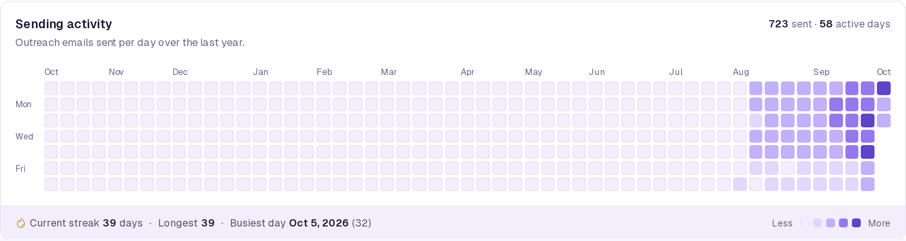
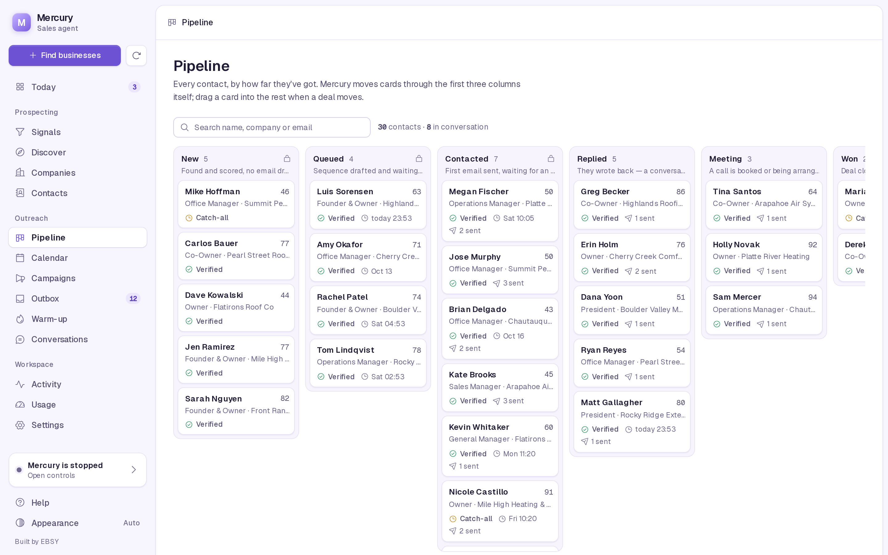
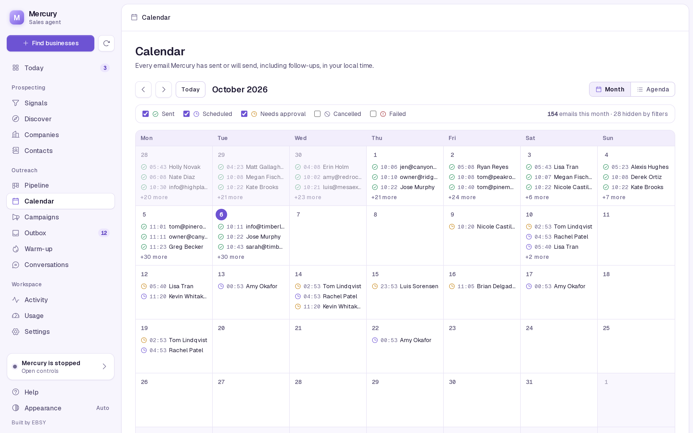
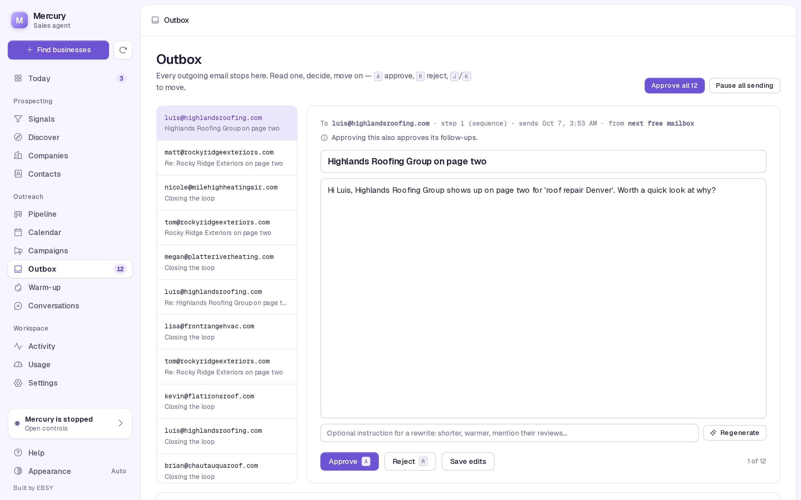
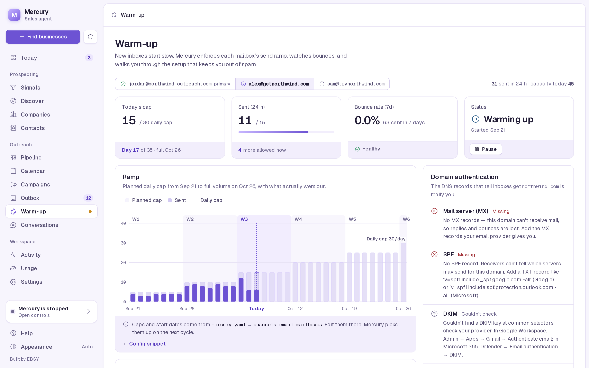

# Dashboard

`mercury dashboard` serves a local web UI on port 5555. It opens on Today, which shows anything waiting on a decision first and then how the pipeline is doing. The other tabs let you confirm signals, run discovery, review and approve email, move deals, watch mailbox warm-up, and read what Mercury did. This page walks through each tab and explains how to reach the dashboard from another machine safely.

```bash
mercury dashboard                          # http://127.0.0.1:5555
mercury dashboard --port 8080
mercury dashboard --host 100.101.102.103   # a specific interface, e.g. your tailnet IP
```

The dashboard reads and writes the same SQLite database as `mercury run`, and the two can run at the same time. It does not run the heartbeat itself. Most views refresh every 15 seconds while visible; the Outbox and Settings tabs do not auto-refresh, so a draft or form you are editing is never re-rendered under you. The theme follows your system until you pick light or dark with the button at the bottom of the sidebar.

## Today


The landing page answers "is anything waiting on me?"

- **KPIs**: Companies (and how many are not yet profiled), Contacts, Awaiting approval (and how many are approved and scheduled), Live conversations. Each card opens its tab.
- **Rates**: reply rate, positive reply rate and bounce rate over the trend window selected below, each with the change against the previous window of the same length. Rates are fractions of outreach emails sent. Bounce rate turns red at 5%.
- **Outreach trend**: emails sent, replies and bounces per day over 7, 30 or 90 days. Click a legend item to hide a series.
- **Sending activity**: a year-long grid of outreach emails sent per day, with total, active days, the current and longest streak, and the best day.
- **Needs you**: decisions only you can make, most blocking first: sending paused, setup incomplete, signals awaiting confirmation, no companies yet, companies not profiled, emails waiting for approval, live conversations.
- **Pipeline**: a funnel from businesses found to profiled, contacts, drafted emails and live conversations.
- **Recent activity**, **Quick actions** (confirm signals, find businesses, review the outbox, see the calendar, export prospects), the setup checklist while setup is incomplete, and **Collector runs** (the latest discovery and profiling jobs with what they found and cost).



How the numbers are counted (`mercury/metrics.py`), all by UTC day:

| Metric | Definition |
|---|---|
| Sent | Outbox rows with status `sent` and kind `sequence`. Mercury's own replies are not outreach and are excluded. |
| Replies | Human replies, at most one per prospect per day. Out-of-office auto-replies are excluded. |
| Positive | Replies classified `interested`. |
| Bounces | Bounce events, at most one per prospect per day. |

There is no open or click rate: Mercury sends plain text with no tracking pixels. Reply rate is the honest measure.

## Signals

Every signal Mercury knows how to collect, grouped into Discovery, Profile, People and Contactability, each with a description, what it costs, and how many companies already carry it. Confirm or reject one signal or a whole category. Nothing is collected until you confirm it.

The **cohort builder** at the bottom counts, live, the companies that carry all the signals you require and none you exclude, and lists up to 200 of them. See [Prospecting](prospecting.md#signals).

## Discover

Provider cards show what each discovery source does, its cost and free tier, which `.env` keys it needs, and whether it is ready. Pick one, adjust cities (one per line; defaults to your ICP), results per query, search depth and the spend cap, then press **Estimate cost**. The Run button stays disabled until you have an estimate. Runs happen in the background; **Stop** ends a run between queries. When there are unprofiled companies, a button reads their sites for free.

Running a provider here also makes it the provider for the daily background discovery run. See [Daily background discovery](prospecting.md#daily-background-discovery).

## Companies

Every business Mercury has recorded. Click a row to see its contacts.

## Contacts

Everyone Mercury has found, with title, company, email status and score. **Export deliverable CSV** downloads verified and risky addresses; **Export all** downloads everything.

## Pipeline



Every contact as a card in one of seven columns:

| Column | Set by | Meaning |
|---|---|---|
| New | Mercury (locked) | Found and scored, no email drafted yet. |
| Queued | Mercury (locked) | Sequence drafted and waiting to send. |
| Contacted | Mercury (locked) | First email sent, waiting for an answer. |
| Replied | Mercury or you | They wrote back; a conversation is open. |
| Meeting | you | A call is booked or being arranged. |
| Won | you | Deal closed. |
| Lost | Mercury or you | Said no, opted out, or went cold. |

You cannot drag a card into the first three columns; Mercury owns those. Moving a card by hand:

| Move to | Prospect status | Conversation | Queued emails |
|---|---|---|---|
| Replied | `replied` | A closed conversation reopens at `engaged`. | kept |
| Meeting | `meeting` | Stage set to `closing` (reopened if it was closed). | **cancelled** |
| Won | `closed` | `closed_won`, closed. | **cancelled** |
| Lost | `lost` | `closed_lost`, closed. | **cancelled** |

Cancelling stops follow-ups from going to someone you are already talking to or have closed. Drag and drop, or use the keyboard: focus a card, <kbd>Enter</kbd> opens its details, <kbd>M</kbd> opens the move menu (arrow keys to choose). The search box filters by name, company or email. Each column shows up to 200 cards, most recent activity first.

## Calendar



Every email Mercury has sent or will send, including follow-ups and replies, in your browser's local time. Switch between Month and Agenda views; filter by Sent, Scheduled, Needs approval, Cancelled and Failed. Click an email to read it and, while it is pending or approved, approve, reject or **reschedule** it to a new time (not in the past). With mailbox rotation, each email shows which address it goes out from.

## Campaigns

The sequences the Writer produced, with their steps and the prospects in each.

## Outbox



The decisions desk. Every outgoing email stops here while `require_approval` is on. The desk shows one pending email at a time with its recipient, step, scheduled time and sending mailbox.

| Key | Action |
|---|---|
| <kbd>A</kbd> | Approve (saves any unsaved edits first) |
| <kbd>R</kbd> | Reject (also rejects later steps of the same sequence) |
| <kbd>J</kbd> | Next email |
| <kbd>K</kbd> | Previous email |

Shortcuts are ignored while you are typing in a field. You can also:

- edit the subject and body and **Save edits**,
- type an optional instruction and **Regenerate**; the rewrite comes back for review,
- **Approve all** pending emails,
- **Pause all sending** / **Resume sending** (the global kill switch; a banner shows when it is on).

Below the desk: sending capacity per mailbox (today's cap after warm-up and health gates, sent in the last 24 hours, remaining), then approved and scheduled emails, recent sends, and failed, rejected or cancelled emails with the reason. See [The approval outbox](email-and-deliverability.md#the-approval-outbox).

## Warm-up



One card per sending mailbox (gmail or smtp; Instantly runs its own warm-up):

- **Stage**: scheduled, warming, warm, fixed (a ramp that never reaches its cap) or paused.
- **Today's cap** after the ramp and health gates, **sent** in the last 24 hours, and **bounce rate** and **reply rate** over the last 7 days with the gate verdict.
- **Plan**: the planned cap per day from `warmup_start` to full volume, against what was actually sent.
- **Week-by-week checklist**: domain setup, light sending, building volume, steady ramp, reaching target, after warm-up. The DNS item ticks itself; you tick the rest.
- **DNS check**: MX, SPF, DKIM and DMARC for the sending domain, each with a plain-language fix.
- **Notes**, and **Pause** / **Resume** for that mailbox.

Caps and start dates come only from `channels.email.mailboxes` in your config; the tab shows a config snippet when none are set. See [Warm-up ramp](email-and-deliverability.md#warm-up-ramp) and [Health gates](email-and-deliverability.md#health-gates).

## Conversations

Every reply thread, the intent Mercury assigned, its stage, and Mercury's responses.

## Activity

The last 100 actions Mercury's agents and the dashboard took: drafts staged, emails sent, replies classified, bounces, pipeline moves, reschedules.

## Usage

Your live Claude quota (5-hour and weekly windows, read the same way Claude Code's `/usage` does) and Mercury's own token usage: totals for today, 7 and 30 days, and breakdowns by agent, task, model and day. Only Mercury's own calls are counted, never your other Claude Code sessions. There are no dollar figures because subscription plans are not billed per token. `mercury usage` shows the same in the terminal.

## Settings

Credentials for the email provider, prospect search, email verification, LinkedIn and Cloudflare. Saving writes them to `.env`. Secrets are shown only as set or not set; their values are never sent back to the browser. Config file settings (`mercury.local.yaml`) are not editable here.

## Controls

Open it from the agent status card at the bottom of the sidebar. It shows whether a Mercury process started from the dashboard is running, Start and Stop buttons, and the last 100 lines of `data/mercury.log`. That log only receives output from processes the dashboard started; `mercury run` in a terminal or under systemd logs to its own stdout (see [Deployment](deployment.md#logs)). For anything long-running, prefer a service.

## Help

What Mercury is, where its files live, where to get each API key, and fixes for common problems.

## Running it on another machine

By default the dashboard listens on `127.0.0.1`, reachable only from the same machine. To reach it from your laptop while Mercury runs on a home server or VPS, either tunnel or bind to a private interface:

```bash
# SSH tunnel: nothing exposed at all
ssh -L 5555:127.0.0.1:5555 you@server        # then open http://127.0.0.1:5555 locally

# Bind to a tailnet (Tailscale/WireGuard) or LAN address
mercury dashboard --host 100.101.102.103
```

**The dashboard has no authentication.** Anyone who can reach the port can approve and send email, pause sending, start and stop the agent, run paid discovery, and overwrite the credentials in `.env`. Bind it only to `127.0.0.1`, a tailnet address or a trusted LAN. Never bind it to `0.0.0.0` on a machine with a public IP, and never put it behind a public reverse proxy without adding authentication in front of it.

## A demo with sample data

To look around without your own data, seed a throwaway database:

```bash
python scripts/seed_demo.py              # writes data/demo.db and data/demo.mercury.yaml
MERCURY_DB_PATH=data/demo.db MERCURY_CONFIG=data/demo.mercury.yaml \
  MAILBOX_DEMO_PASSWORD=demo mercury dashboard
```

The seed creates about a dozen companies, 30 prospects across every pipeline column, two months of outreach history, and three demo mailboxes (one warm and on hold, one warming, one scheduled). It refuses to touch `data/mercury.db` and never sends anything. Don't run `mercury run` with that environment.
